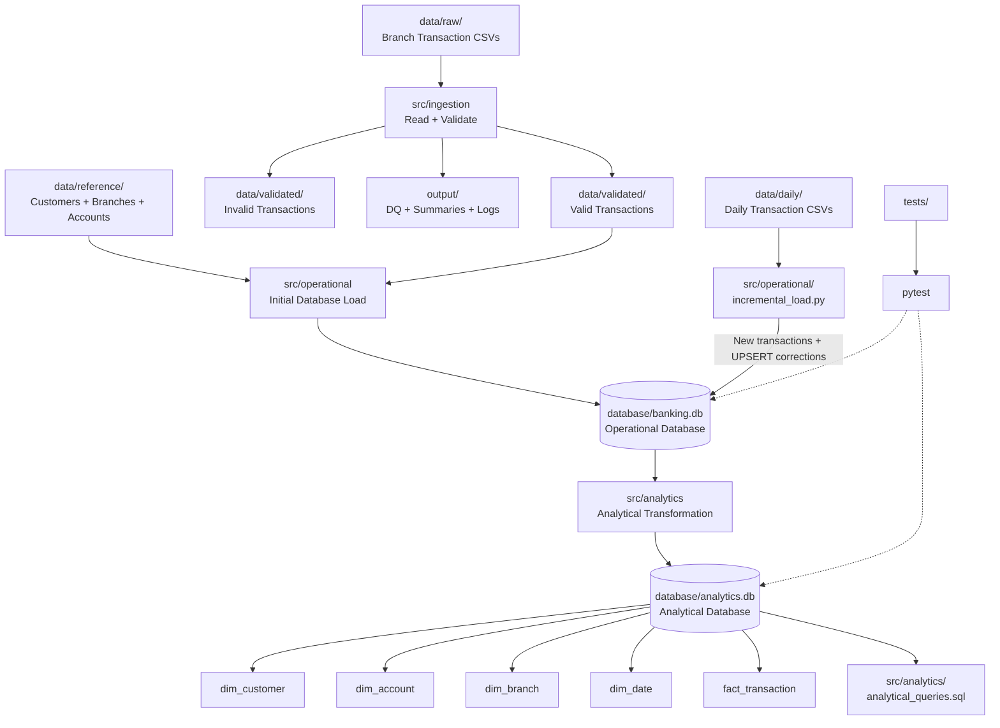

# Banking Data Pipeline — Week 5

A Python-based banking data pipeline that processes transaction data, performs data-quality validation, loads data into a relational SQLite database, handles incremental daily updates, and builds an analytical layer using a star schema.

## Overall Architecture



## Project Structure

```text
banking_data_pipeline/
│
├── config/
│   └── config.py
│
├── data/
│   ├── raw/
│   ├── reference/
│   ├── validated/
│   └── daily/
│
├── database/
│   ├── banking.db
│   └── analytics.db
│
├── docs/
│   ├── analytics/
│   └── erd/
│
├── evidence/
│   ├── class_4/
│   └── week_5/
│
├── output/
│   ├── dq/
│   ├── logs/
│   └── summaries/
│
├── sql/
│   └── operational_queries.sql
│
├── src/
│   ├── ingestion/
│   │   ├── pipeline.py
│   │   ├── validation.py
│   │   └── dq_metrics.py
│   │
│   ├── operational/
│   │   ├── database.py
│   │   ├── schema.sql
│   │   ├── load_data.py
│   │   ├── incremental_load.py
│   │   ├── check_database.py
│   │   └── run_query.py
│   │
│   └── analytics/
│       ├── analytical_queries.sql
│       └── build_analytics.py
│
├── tests/
│   ├── test_incremental_load.py
│   ├── test_analytics.py
│   └── run_analyisis.py
│
├── .gitignore
└── requirements.txt
```

## Main Components

### 1. Ingestion & Validation

Raw transaction CSV files are processed using Python and Pandas.

The pipeline:

- Reads transaction files
- Validates required columns
- Validates transaction values
- Separates valid and invalid records
- Generates data-quality summaries

### 2. Operational Database

The validated transactions are stored in `banking.db`.

Main tables:

```text
branches
customers
accounts
transactions
```

SQLite constraints are used to maintain data integrity.

### 3. Incremental Processing

Daily transaction files are processed without rebuilding the entire database.

The incremental process:

```text
Daily CSV
   ↓
Read transactions
   ↓
Check transaction_id
   ↓
New transaction → INSERT
Corrected transaction → UPDATE
   ↓
Updated banking.db
```

UPSERT logic makes the process rerun-safe.

### 4. Analytical Layer

The trusted operational database is transformed into `analytics.db`.

The analytical model contains:

```text
dim_branch
dim_customer
dim_account
dim_date
      │
      ▼
fact_transaction
```

The fact table stores transaction-level analytical data.

### 5. Analytical SQL

Analytical queries are stored in:

```text
src/analytics/analytical_queries.sql
```

They are used for:

- Branch analysis
- Transaction-type analysis
- Customer analysis
- Account analysis
- Daily analysis
- Transaction classification
- Running totals
- Business questions

## Technologies

- Python
- Pandas
- SQLite
- SQL
- Pytest
- Git & GitHub

## Run the Project

Activate the virtual environment:

```powershell
.venv\Scripts\Activate.ps1
```

Run the ingestion pipeline:

```powershell
py src/ingestion/pipeline.py
```

Load the operational database:

```powershell
py src/operational/database.py
py src/operational/load_data.py
```

Run incremental processing:

```powershell
py src/operational/incremental_load.py
```

Build the analytical database:

```powershell
py src/analytics/build_analytics.py
```

Run tests:

```powershell
py -m pytest -q
```

## Test Result

Current project test result:

```text
11 passed
```

## Data Flow Summary

```text
Raw CSV
  ↓
Ingestion
  ↓
Validation
  ↓
Valid Transactions
  ↓
banking.db
  ↓
Incremental UPSERT
  ↓
Updated Operational Data
  ↓
analytics.db
  ↓
Analytical SQL
  ↓
Business Analysis
```

## 6 Concept Questions

### 1. Why is incremental processing important?

Incremental processing allows the pipeline to process only new or changed data instead of rebuilding the complete dataset every time.

In this project, daily transaction files are processed using incremental loading. New transactions are inserted, while corrected transactions are updated using UPSERT logic.

---

### 2. What happens if the same daily file is processed twice?

The pipeline is designed to be rerun-safe.

When the same transaction is processed again, the existing `transaction_id` is detected and the record is updated instead of creating a duplicate transaction.

Therefore, rerunning the same daily file does not increase the number of transaction records unnecessarily.

---

### 3. Why should the analytical database be built from the operational database instead of raw CSV files?

The operational database contains trusted and validated data.

Building the analytical layer from `banking.db` ensures that the analytical database uses the controlled operational dataset rather than bypassing validation and integrity checks applied to the raw data.

In this project:

```text
Raw CSV
   ↓
Validation
   ↓
banking.db
   ↓
Analytical Transformation
   ↓
analytics.db
```

---

### 4. Why is a star schema useful for analytical queries?

A star schema separates transaction facts from descriptive dimensions.

In this project:

```text
              dim_customer
                   │
                   │
dim_branch ── fact_transaction ── dim_account
                   │
                   │
                dim_date
```

The `fact_transaction` table stores transaction-level data, while the dimension tables provide information about customers, accounts, branches, and dates.

This structure makes analytical queries easier to organize and understand.

---

### 5. What is the grain of the fact table?

The grain of `fact_transaction` is:

> **One row represents one banking transaction identified by `transaction_id`.**

Each fact row connects the transaction to:

- Customer
- Account
- Branch
- Date

This clearly defines what one row in the fact table represents and prevents ambiguity when performing analytical calculations.

## Goal

The project demonstrates a complete small-scale data engineering workflow:

**Ingestion → Validation → Relational Storage → Incremental Processing → Analytical Modeling → SQL Analysis → Testing**
