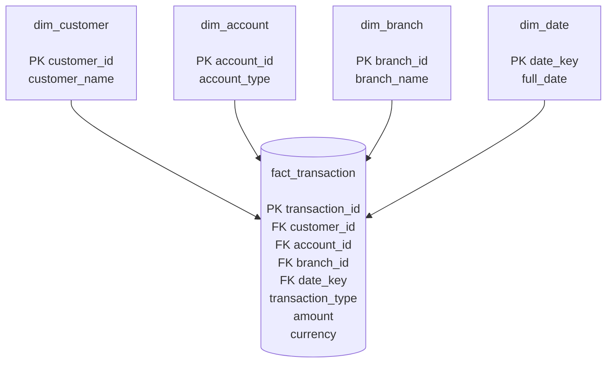

# Star Schema

The analytical layer is built from the trusted operational database `banking.db` and stored in `analytics.db`.

## Analytical Star Schema



## Star Schema Structure

```text
                         ┌──────────────────────┐
                         │     dim_customer     │
                         │──────────────────────│
                         │ PK customer_id       │
                         │ customer_name        │
                         └──────────┬───────────┘
                                    │
                                    │
┌──────────────────────┐            │            ┌──────────────────────┐
│     dim_branch       │            │            │     dim_account      │
│──────────────────────│            │            │──────────────────────│
│ PK branch_id         │            │            │ PK account_id        │
│ branch_name          │            │            │ account_type         │
└──────────┬───────────┘            │            └──────────┬───────────┘
           │                        │                       │
           │                        │                       │
           └────────────────┐       │       ┌───────────────┘
                            │       │       │
                            ▼       ▼       ▼
                     ┌─────────────────────────┐
                     │    fact_transaction     │
                     │─────────────────────────│
                     │ PK transaction_id       │
                     │ FK customer_id          │
                     │ FK account_id           │
                     │ FK branch_id            │
                     │ FK date_key             │
                     │ transaction_type        │
                     │ amount                  │
                     │ currency                │
                     └────────────┬────────────┘
                                  │
                                  │
                         ┌────────▼───────────┐
                         │      dim_date      │
                         │────────────────────│
                         │ PK date_key        │
                         │ full_date          │
                         └────────────────────┘
```

## Tables

| Table | Type | Purpose |
|---|---|---|
| `fact_transaction` | Fact | Stores transaction-level analytical data |
| `dim_customer` | Dimension | Stores customer information |
| `dim_account` | Dimension | Stores account information |
| `dim_branch` | Dimension | Stores branch information |
| `dim_date` | Dimension | Stores transaction date information |

## Fact Table Grain

The grain of `fact_transaction` is:

> **One row represents one banking transaction identified by `transaction_id`.**

The fact table connects the transaction to the customer, account, branch, and date dimensions.

## Data Flow

```text
banking.db
    │
    │ Analytical Transformation
    ▼
analytics.db
    │
    ├── dim_customer
    ├── dim_account
    ├── dim_branch
    ├── dim_date
    │
    └── fact_transaction
```

## Why It Is a Star Schema

`fact_transaction` is the central fact table, while the four dimension tables surround it:

```text
             dim_customer
                  │
                  │
dim_branch ── fact_transaction ── dim_account
                  │
                  │
               dim_date
```

This structure makes analytical queries easier for questions such as:

- Transaction amount by branch
- Transaction amount by customer
- Transaction amount by account
- Daily transaction analysis
- Transaction type analysis
- Customer and branch analysis
